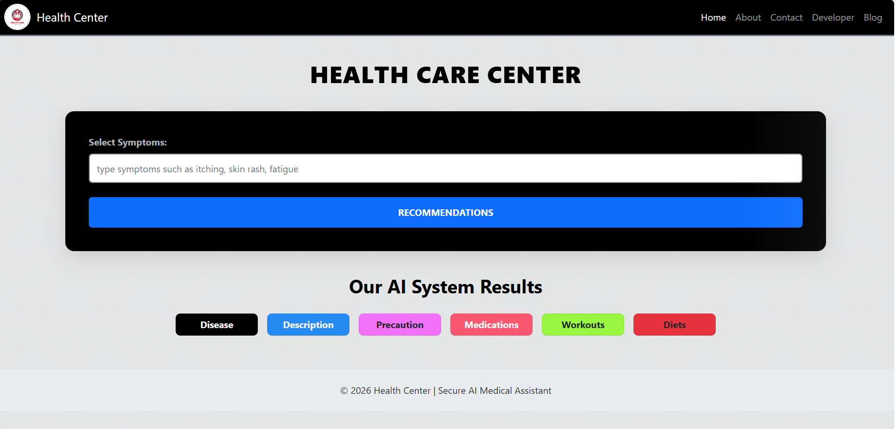

#  Medicine Recommendation System

## Overview
This is a Machine Learning based Medicine Recommendation System developed using Python, Flask, and Jupyter Notebook. The system predicts diseases from user symptoms and provides medicine recommendations, precautions, diet plans, and workout suggestions.

## Features
- Disease Prediction using Machine Learning
- Medicine Recommendation
- Precautions Suggestion
- Diet Recommendation
- Workout Recommendation
- User-friendly Web Interface

## Technologies Used
- Python
- Flask
- Scikit-learn
- Pandas
- HTML
- CSS
- Jupyter Notebook

## Project Screenshot

## How to Run

1. Clone the repository
2. Install dependencies
3. Run `main.py`
4. Open the browser and access the Flask application

## Author

Kavya Tyagi
